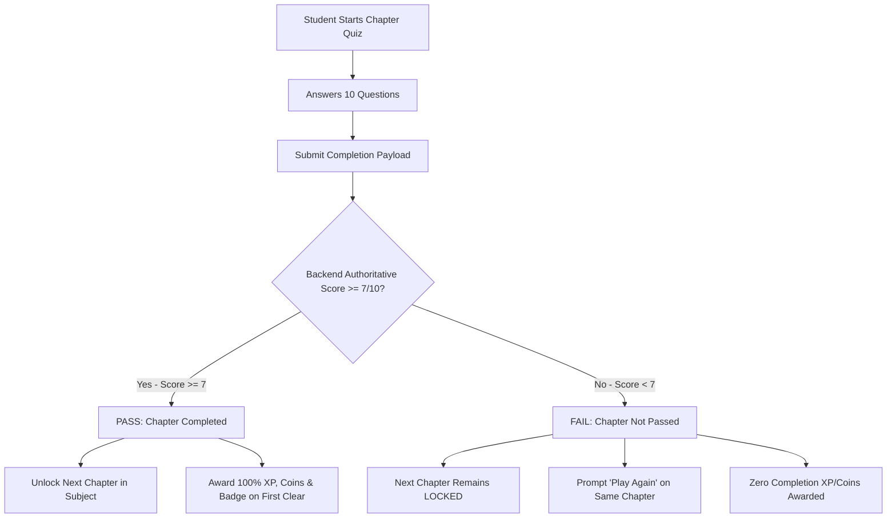

# ChemEscape — Chapter Pass Threshold & Progression Architecture

## 1. Overview & Core Pass Rule
All generic chapter quiz missions across all standards (Standard 4 through Standard 12) and all subjects (Tamil, English, Mathematics, Science, Social Science, Physics, Chemistry, Biology, Computer Science) utilize a centralized, server-authoritative pass threshold rule.

### Default Pass Condition:
- **Total Questions**: 10
- **Minimum Required Score**: 7 / 10 (70% accuracy)
- **Evaluation**:
  - `score >= 7` (7, 8, 9, 10) $\rightarrow$ **PASS**
  - `score < 7` (0, 1, 2, 3, 4, 5, 6) $\rightarrow$ **FAIL**

---

## 2. Server-Authoritative Progression Lifecycle



---

## 3. Detailed Lifecycle Behaviors

### A. Failed Chapter Attempt (Score 0–6 / 10)
- **Server Response**:
  ```json
  {
    "completed": false,
    "passed": false,
    "score": 6,
    "totalQuestions": 10,
    "minimumPassScore": 7,
    "retryRequired": true,
    "nextChapterUnlocked": false,
    "awardedXP": 0,
    "awardedCoins": 0,
    "badgeUnlocked": null
  }
  ```
- **Database State**: `isCompleted: false`, `attempts` incremented.
- **Client Result Screen**:
  - 🔴 Heading: `Chapter Not Passed`
  - Tag: `MISSION NOT PASSED • RETRY REQUIRED`
  - Badge / Stat: Score `6/10` (Required: `7/10`)
  - Primary Action: `[Play Again]` $\rightarrow$ resets and restarts the **same chapter**.

### B. Passed Chapter Attempt (Score 7–10 / 10)
- **Server Response**:
  ```json
  {
    "completed": true,
    "passed": true,
    "score": 7,
    "totalQuestions": 10,
    "minimumPassScore": 7,
    "retryRequired": false,
    "nextChapterUnlocked": true,
    "isFirstCompletion": true,
    "awardedXP": 500,
    "awardedCoins": 100,
    "badgeUnlocked": { ... }
  }
  ```
- **Database State**: `isCompleted: true`, high score recorded.
- **Client Result Screen**:
  - 🟢 Heading: `Chapter Completed!`
  - Tag: `MISSION PASSED • NEXT CHAPTER UNLOCKED`
  - Badge / Stat: Score `7/10` (Required: `7/10`)
  - Actions: `[Back to Chapters]` and `[Replay]`.

---

## 4. Replay & Best Score Safety
- If a chapter was **previously passed** (e.g. 8/10 on Attempt 1) and the student chooses to **replay** and achieves a lower score (e.g. 5/10 on Attempt 2):
  - The chapter status **remains COMPLETED**.
  - The unlocked next chapter **remains UNLOCKED**.
  - Best confirmed score is preserved (`Math.max(previousScore, currentScore)`).
  - No duplicate first-clear badge or full coins are awarded.

---

## 5. Security & Isolation Matrix

| Boundary | Enforcement | Validation Result |
| :--- | :--- | :--- |
| **Client Tampering** | Backend calculates actual pass decision from authoritative scores | Passed/Completed fields from client ignored |
| **User Isolation** | User A failure (6/10) does not affect User B pass (7/10) | Verified in `testChapterPassThreshold.js` |
| **Subject Isolation** | Passing Tamil Ch 1 unlocks Tamil Ch 2 only; Math Ch 2 stays locked | Verified in `testStandard4AllSubjects.js` |
| **Standard Isolation** | Passing Std 4 Math Ch 1 does not unlock Std 5 Math Ch 2 | Verified in `testChapterPassThreshold.js` |
| **Chemistry Engines** | Units 1–6 retain specialized multi-stage unlock rules | Verified in `testMasterE2E.js` |

---

## 6. Verification Suites
- **`src/utils/testChapterPassThreshold.js`**: 14 tests verifying 0..6 fail, 7..10 pass, user/subject/standard isolation, replay safety, and idempotency.
- **`src/utils/testAnswerValidation.js`**: 33 tests verifying server-side answer evaluation.
- **`src/utils/testStandard4AllSubjects.js`**: 41 tests verifying Standard 4 Tamil, English, Math, Science, Social Science.
- **`src/utils/testMasterE2E.js`**: 26 tests verifying authentication, security, and Units 1–6 Chemistry engines.