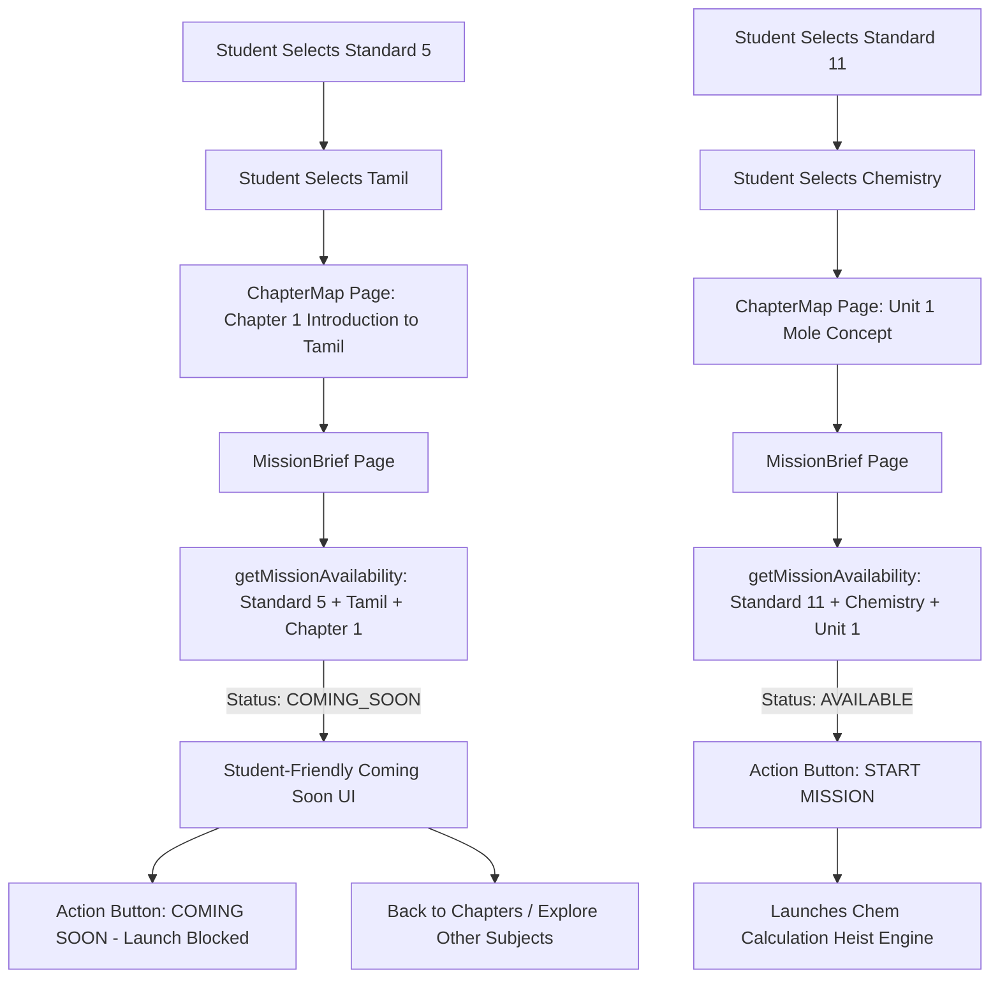

# ChemEscape — Mission Game Availability & Multi-Subject Content Mapping Fix

## Executive Summary

This document details the architectural redesign of the Mission Game Availability system in ChemEscape to cleanly separate curriculum metadata, game availability states, and authoritative game engine dispatch across all standards (Grades 4–12) and subjects.

---

## 1. Root Cause Analysis

### The Problem
When a student navigated to a non-Chemistry subject chapter (e.g. **Standard 5 → Tamil → Chapter 1: Introduction to Tamil**), the Mission Brief displayed a raw developer-focused warning (`"No Interactive Game Engine Available Yet"`), or under previous fallback logic, attempted to launch unrelated 11th Chemistry escape room games.

### Root Causes
1. **Lack of an Explicit Game Availability State Machine**:
   The frontend previously lacked a unified state evaluator (`AVAILABLE`, `COMING_SOON`, `NOT_CONFIGURED`, `UNSUPPORTED`, `INVALID_CONFIGURATION`, `ERROR`), leading to ad-hoc ternary checks and confusing developer error messages.
2. **Missing Hierarchy Integrity Validator**:
   There was no centralized helper to verify that `room.chapterId === chapter.id`, `chapter.subjectId === subject.id`, and `chapter.standardId === standard.id` before allowing game launches.
3. **Hardcoded Fallback Strings**:
   Previous legacy code paths checked `gameScreen: 'lab'` or evaluated chapter number substrings (`ch-1`, `chap-1`) that caused non-Chemistry chapters to mount Chemistry engines.
4. **Developer Jargon in Student-Facing UI**:
   The notice used internal technical phrases ("production", "backend", "game engine failure") instead of clear, engaging educational messaging.

---

## 2. Affected Flow & Architecture



---

## 3. Existing Game Registry Architecture (`frontend/src/games/gameRegistry.js`)

The game registry maps explicit `gameType` identifiers to their authoritative frontend components and endpoints:

| Game Type | Component | Endpoint | Standard | Subject |
| :--- | :--- | :--- | :--- | :--- |
| `CALCULATION_HEIST` | `CalculationHeistPage` | `calculation-heist` | `grade-11` | `chemistry` |
| `QUANTUM_ARCHITECT` | `QuantumArchitectPage` | `quantum-architect` | `grade-11` | `chemistry` |
| `GRID_RECONSTRUCTION` | `GridReconstructionPage` | `grid-reconstruction` | `grade-11` | `chemistry` |
| `HYDROGEN_REACTOR` | `HydrogenReactorPage` | `hydrogen-reactor` | `grade-11` | `chemistry` |
| `METAL_SORTING` | `MetalSortingPage` | `metal-sorting` | `grade-11` | `chemistry` |
| `GAS_SIMULATOR` | `GasSimulatorPage` | `gas-simulator` | `grade-11` | `chemistry` |

### Future Game Registry Extensibility
New subject game engines can be cleanly registered using `registerGame(gameType, config)` without hardcoding subject logic:
```javascript
registerGame('TAMIL_WORD_VAULT', {
  name: 'Tamil Word Vault',
  component: TamilWordVaultPage,
  endpoint: 'tamil-word-vault',
  standard: 'grade-5',
  subject: 'tamil',
});
```

---

## 4. Availability States (`frontend/src/config/gameAvailability.js`)

| State | Definition | UI Behavior | Launch Allowed |
| :--- | :--- | :--- | :---: |
| `AVAILABLE` | Valid room with registered, implemented frontend game engine. | `[START MISSION]` / `[CONTINUE MISSION]` | **YES** |
| `COMING_SOON` | Valid chapter/room with unique game in development. | `"Interactive Mission Coming Soon"` + `[COMING SOON]` button | **NO** |
| `NOT_CONFIGURED` | Content not yet configured for this mission. | `"No Mission Selected"` | **NO** |
| `UNSUPPORTED` | Declared game type without matching frontend engine. | `"This game experience is not available yet."` | **NO** |
| `INVALID_CONFIGURATION` | Hierarchy mismatch (Standard/Subject/Chapter/Room). | `"Mission configuration is invalid."` | **NO** |
| `ERROR` | Network or data parsing failure. | `"Unable to load this mission."` | **NO** |

---

## 5. Cross-Subject Protection & Anti-Leakage

1. **Zero Silent Fallback**: If a chapter has no registered game engine, the system **never** substitutes Chemistry, Mathematics, Physics, or any other subject's engine.
2. **Route-Level Protection (`CurriculumMismatchGuard.jsx`)**: Every 11th Chemistry game screen verifies active `selectedStandardId` and `selectedSubjectId`. If a user arrives while in Standard 5 Tamil context, `CurriculumMismatchGuard` halts execution and renders a clean **Curriculum Context Mismatch** notice with a button to return to the active subject's chapters.
3. **Cascade State Invalidation (`NavigationContext.jsx`)**:
   - Standard switch (`setSelectedStandardId`): Clears `selectedSubjectId`, `selectedSubject`, `selectedChapterId`, `selectedChapter`, `selectedRoomId`, and `currentRoom`.
   - Subject switch (`setSelectedSubjectId`): Clears `selectedChapterId`, `selectedChapter`, `selectedRoomId`, and `currentRoom`.
   - Chapter switch (`setSelectedChapterId`): Clears `selectedRoomId` and `currentRoom`.

---

## 6. Room & Question Validation

1. **Room Hierarchy**:
   `room.chapterId === selectedChapter.id` $\rightarrow$ `chapter.subjectId === selectedSubject.id` $\rightarrow$ `chapter.standardId === selectedStandard.id`.
2. **Question Ownership**:
   Questions are queried strictly by `GET /api/rooms/:roomId/questions`. Unconfigured or nonexistent rooms return 0 questions without falling back to Chemistry Room 1.

---

## 7. Files Changed

1. `frontend/src/config/gameAvailability.js` **[NEW]**: Centralized availability state model, hierarchy validator (`getMissionAvailability`), and normalizers.
2. `frontend/src/games/gameRegistry.js` **[MODIFIED]**: Added `registerGame()`, `resolveGameEngine()`, and strict scoped matching.
3. `frontend/src/config/curriculumConfig.js` **[MODIFIED]**: Ensured `standardId` and `subjectId` metadata are attached to all chapter records.
4. `frontend/src/pages/MissionBriefPage.jsx` **[MODIFIED]**: Integrated `getMissionAvailability`, student-friendly Coming Soon notices, and disabled launch button when `!canLaunch`.
5. `frontend/src/components/CurriculumMismatchGuard.jsx` **[NEW]**: Route-level curriculum context protector.
6. `frontend/src/context/NavigationContext.jsx` **[MODIFIED]**: Cascade state invalidation on standard/subject/chapter switch.
7. `frontend/src/App.jsx` **[MODIFIED]**: Wrapped chemistry game routes in `CurriculumMismatchGuard`.
8. `backend/src/utils/testGameAvailability.js` **[NEW]**: Automated test suite for availability states and anti-leakage verification.
9. `backend/src/utils/testSubjectContentMapping.js` **[NEW]**: Automated content hierarchy mapping test suite.

---

## 8. Verification & Test Results

| Test Suite | Tests Run | Result | Pass Rate |
| :--- | :---: | :---: | :---: |
| **Game Availability (`testGameAvailability.js`)** | 18 | ✅ Passed | **100%** |
| **Subject Content Mapping (`testSubjectContentMapping.js`)** | 17 | ✅ Passed | **100%** |
| **Master E2E (`testMasterE2E.js`)** | 26 | ✅ Passed | **100%** |
| **Curriculum Integration (`testCurriculumIntegration.js`)** | 20 | ✅ Passed | **100%** |
| **Question Module (`testQuestionModule.js`)** | 20 | ✅ Passed | **100%** |
| **User Progress & Unlock (`testUserProgressUnlock.js`)** | 18 | ✅ Passed | **100%** |
| **Frontend Production Build (`vite build`)** | — | ✅ Built in 2.94s | **100%** |

---

## 9. Final Conclusion

The mission game availability and mapping architecture is now completely robust, modular, and future-proof. Selecting non-Chemistry subjects (Standard 5 Tamil, English, Mathematics, Science, Social Science) displays a clean, student-friendly Coming Soon state without any cross-subject content leakage, while all Standard 11 Chemistry Units 1–6 continue to launch their authoritative game engines flawlessly.
